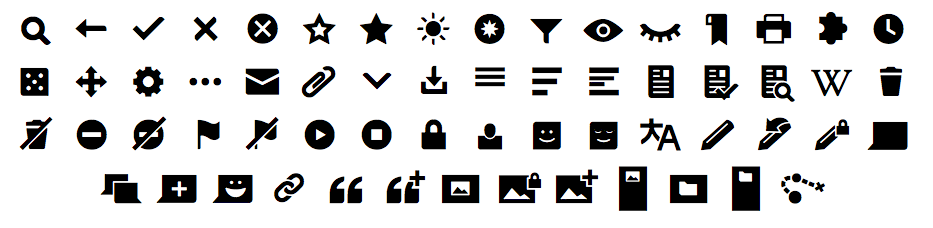

Current
----



WikiFont is a project by the Wikimedia Foundation. Ongoing talks mainly [on trello](https://trello.com/c/rClBTMWE/26-wikifont-tracking).

Minimal HTML code
----
This minimal `demo.html` requires the font files and `font.css` of this repository.

````
<!DOCTYPE html>
<html lang="en">
  <head>
    <meta charset="utf-8">
    <title>WikiFont minimal code</title>
    <link rel="stylesheet" href="font.css">
    <style>
	  i { 
	    font-family: WikiFont-Regular; 
	    font-size: 3em;
	    font-style: normal;
	  }
	</style>
  </head>
	<body>
		<i class="WikiFont-puzzle"></i>
		<i class="WikiFont-bookmark"></i>
		<i class="WikiFont-wikitrail"></i>
		<i class="WikiFont-gear"></i>
		<i class="WikiFont-user-face-smile"></i>
		<i class="WikiFont-pencil"></i>
		<i class="WikiFont-image-add"></i>
		<i class="WikiFont-link"></i>
		<i class="WikiFont-quotes-add"></i>
		<i class="WikiFont-speech-bubbles"></i>
		and so on.
	</body>
</html>
````

Credit
----
* Munmay (WMF)
